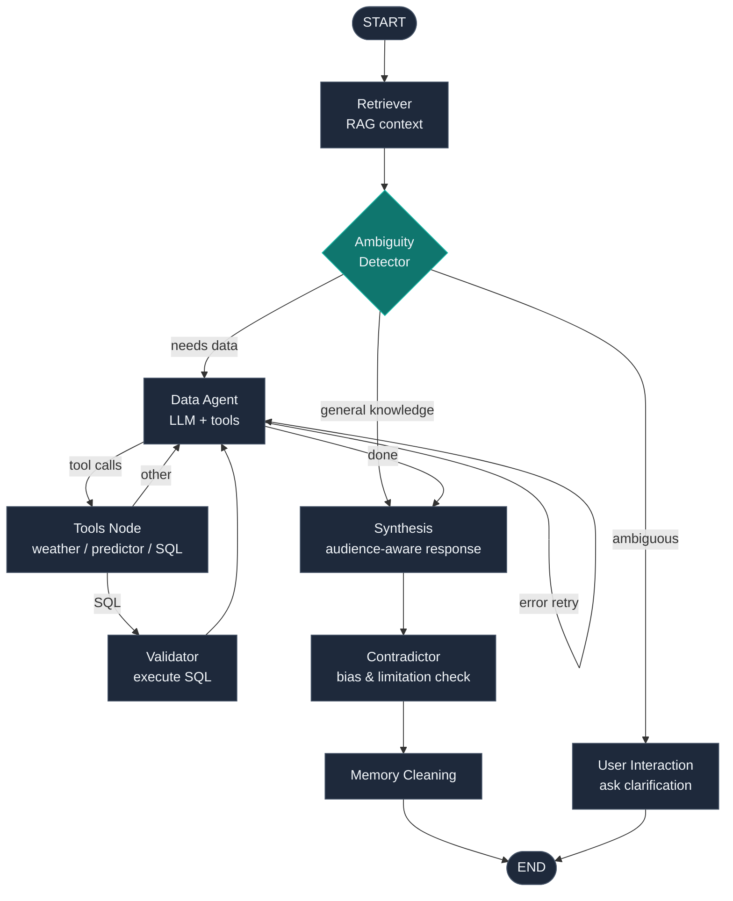

# MobilityCopilot

> An AI-powered urban mobility assistant for Montreal, built on a multi-agent LangGraph workflow with RAG, predictive ML modeling, and real-time data integration.

[](https://github.com/GabinVr/MobilityCopilot/actions/workflows/python-app.yml)
[](https://codecov.io/gh/GabinVr/MobilityCopilot)

<!-- TODO: Add a screenshot or demo GIF here -->

## What It Does

MobilityCopilot lets users ask natural-language questions about Montreal's urban mobility (traffic collisions, 311 requests, transit, weather impacts) and get data-grounded, source-cited answers. It combines real-time weather APIs, 892 MB of municipal open data, and a collision prediction model into a conversational interface.

**Example queries:**
- *"How many collisions happened last winter near downtown?"*
- *"Is there a correlation between rain and 311 pothole reports?"*
- *"What's the predicted collision count for tomorrow given the weather forecast?"*

## Architecture

### Multi-Agent LangGraph Workflow

The core is a **9-node stateful graph** with conditional routing, not a simple prompt chain:



**Key design decisions:**
- **Conditional routing** — the ambiguity detector classifies each query and routes to the appropriate subgraph (clarification, data retrieval, or direct synthesis)
- **Self-correcting SQL loop** — the data agent generates SQL, the validator executes it, and errors are fed back for retry (up to a configurable limit)
- **Contradictor node** — a dedicated node that critically analyzes every response for data biases, sample size issues, and limitations before returning to the user
- **Audience-aware synthesis** — responses adapt between general public and municipal employee personas

### ML Collision Predictor

A **HistGradientBoostingRegressor** trained on real Montreal collision data with **82 engineered features**:
- Temporal: day of week, month, quarter with sine/cosine cyclical encoding
- Weather: temperature, precipitation, snow depth
- Lag features: 1-4 day lookback with rolling means and maxes
- Interaction terms: temperature x precipitation, freeze/rain binary indicators

Integrated as a LangGraph tool — the agent calls it with live weather forecasts to predict daily collision counts.

### RAG Pipeline

- **ChromaDB** vector store with HuggingFace `all-MiniLM-L6-v2` embeddings
- Domain glossaries, dataset schemas, and business rules as grounding context
- Injected at the start of every query to keep LLM responses factually grounded

### Semantic Caching

Redis-backed `RedisSemanticCache` with embedding similarity lookup — similar questions hit the cache instead of re-invoking the full LangGraph pipeline. Reduces latency and LLM API costs.

## Design Decisions

**Why LangGraph over a simple chain?** Mobility questions vary wildly in shape — some need SQL, some need weather APIs, some are ambiguous, some are general knowledge. A linear chain would either overfit to one case or waste tokens on every call. LangGraph lets the agent branch based on query classification, retry on SQL errors, and short-circuit when clarification is needed — all with a single compiled graph and a typed state schema.

**Why a dedicated Contradictor node?** LLMs confidently present biased data as fact. The 311 dataset is declarative (self-reported), weather is regional-average, and sample sizes in sub-queries can be tiny. Rather than hoping the synthesis prompt catches all of this, a separate node reviews every response and explicitly surfaces limitations — making the assistant safer to expose to municipal decision-makers.

**Why semantic caching instead of exact-match?** Users ask the same thing in different words ("collisions in winter" vs "winter crashes"). Exact-match caching misses these; running the full graph every time is expensive. An embedding-similarity cache (Redis + sentence-transformers) catches paraphrases and cuts average latency while staying within LLM budget.

**Why swappable LLM providers?** Local development runs on Ollama (free, private). Production can use OpenAI or Mistral for quality. GitHub Models is a free hosted option for CI/demos. The `LLM_PROVIDER` env var and the factory in `utils/llm_provider.py` keep provider choice out of business logic.

**Why a trained ML model alongside the LLM?** Predicting collision counts from weather is a numerical regression problem — the wrong tool for an LLM. A HistGradientBoostingRegressor with engineered temporal and weather features is both more accurate and auditable. The agent calls it as a tool with live forecast inputs, combining LLM reasoning with classical ML where each shines.

## Tech Stack

| Layer | Technology |
|-------|-----------|
| **Agent framework** | LangGraph (9 nodes, conditional edges, tool calling) |
| **Backend** | FastAPI, Uvicorn, APScheduler |
| **LLM providers** | OpenAI, Mistral, Ollama, Gemini, GitHub Models (swappable via env var) |
| **Vector DB** | ChromaDB + HuggingFace Sentence Transformers |
| **ML** | scikit-learn HistGradientBoostingRegressor (82 features) |
| **Cache** | Redis (semantic cache + API response cache) |
| **Database** | SQLite (892 MB Montreal open data) |
| **External APIs** | Environment Canada GeoMet (live + historical weather) |
| **Frontend** | Bun, Elysia, HTMX, TypeScript (BETH stack) |
| **Infra** | Docker Compose, GitHub Actions CI/CD, Codecov, DigitalOcean |

## Quick Start

### Docker (recommended)

```bash
cp .env.example .env    # Configure your LLM provider API keys
docker compose up --build
```

The app is available at `http://localhost:3000`.

### Local Development

```bash
# Backend
python -m venv .venv && source .venv/bin/activate
pip install -r requirements.txt
uvicorn main:api --reload    # http://localhost:1337

# Frontend
cd view && bun install && bun run dev    # http://localhost:3000
```

Requires Redis and ChromaDB running locally (see `docker-compose.yml` for service configs).

### Run Tests

```bash
pytest                           # All tests
pytest tests/unit/core/          # Core agent logic only
pytest -k "test_name"            # Single test
pytest --cov=. --cov-report=html # Coverage report
```

## Project Structure

```
core/
├── graph.py              # LangGraph workflow definition & routing logic
├── state.py              # TypedDict state schema (messages, flags, context)
├── nodes/                # Node implementations (ambiguity, synthesis, contradictor...)
└── tools/                # Agent tools (SQL generator, weather APIs, collision predictor)
rag/                      # RAG corpus builder & ChromaDB repository
data/                     # Data ingestion pipeline, SQLite DB, trend/dashboard queries
model/                    # Trained ML model (joblib) & feature engineering
routes/                   # FastAPI endpoint handlers (chat, dashboard analytics)
services/                 # Background services (weekly reports, 311 sync)
utils/                    # LLM provider factory, ChromaDB client, caching utilities
tests/                    # Unit & integration tests with Redis mocking
view/                     # BETH stack frontend
```

## Contributing

1. Branch from `main` (e.g. `feature/new-node`)
2. Implement and test locally
3. Open a PR against `main`
